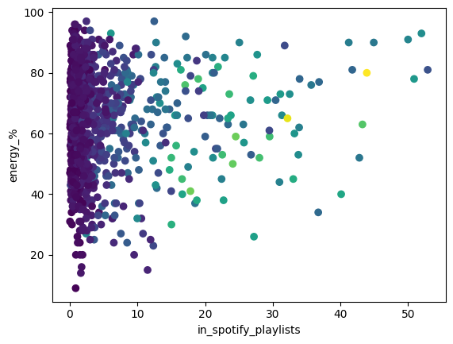
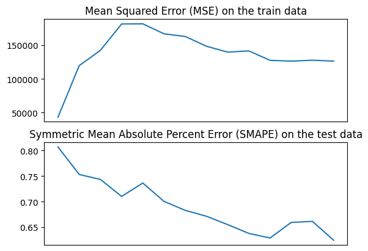

# Predicting streams in Spotify Data

Ethan Cohen

## Overall Approach

In order to predict the quantity of streams in a song, I started by looking for correlation in the data. While most of the data appeared to be largely uncorrelated, there was a fairly good correlation between streams and the number of times a given song had been added to a playlist. In addition, the rated energy percent of each song was also a decent predictor of the amount of streams (though it was much weaker). Taken together, the two variables could roughly be approximated by a polynomial function. In the below graph, color represents the number of streams (ranging from dark purple meaning few streams and bright yellow meaning many streams).

Though obviously the relationship is complex (including two very large outliers), it's not too complex to model roughly. So, I got to work building a model for a polynomial relationship between these variables. The model itself can be found in [`nonlinear.py`](nonlinear.py) and is tested in [`process_spotify.ipynb`](process_spotify.ipynb). The data is processed entirely within [`data.py`].

## Data Preprocessing

The full dataset from Kaggle contains 1000 rows, of which the vast majority are usable. The full preprocessing does the following:

1. Drops rows where relevant data is missing (this means streams, playlist count, and energy percent score)
2. One of the rows was corrupted, so instead of a quantity of streams it is actually a concatenation of the rest of the row (including the headers). This makes the entire column strings when being read in, so this step converts the column to integers and removes the errant row.
3. Since songs are added to lots of playlists and streamed even more often, the units were changed to thousands of playlists and millions of streams. This prevents a bug where a large enough weight could cause either an overflow or underflow in outlier predictions. Initially, this meant the model would predict decreasing streams as playlist count rose so that it would underflow before reaching the outliers and giving them absurdly high predicted stream values.

Once these three steps were taken, the dataset is partitioned into train, test, and hold-out sets. There are two large outliers in the data (Shape of You by Ed Sheeran and Blinding Lights by the Weeknd both have almost 4 billion streams), but hugely popular songs are bound to have many more streams than everything else. Those two outliers stayed in (and actually both wound up in the training data).

## Building the Model

I ultimately chose a nonlinear least squares regression model. However, rather than consider all possible combinations of variables, I considered each variable separately. This means that, for instance, a polynomial with 2 variables of degree 2 would be modeled as $a_{1}x_{1}^{2} + a_{2}x_1 + a_{3}x_2^{2} + a_{4}x_2 + a_{5}$. I chose this model for two reasons:

1. Despite a large amount of noise in the data, there were independent correlations between each input variable and the number of streams.
2. No probability distribution appears to closely models the data, so a least squares regression was chosen to minimize bias.

In order to build the model correctly, I created a sample dataset to build off of (results of this are in `sample.ipynb`). That dataset drew from a polynomial distribution of points and served to check that the model worked as intended. I found myself struggling to get a reasonable error, so having some sort of proof that the core algorithm still worked was important.

## Tuning the model

A regression model is necessarily going to have some amount of error associated with it. Even if the model had infinite training data, there is a significant amount of noise in the data itself. No matter how good the regression is, the heavy noise will always matter a lot. The learning curve for the model reflects this noise, as the test scores level off around 60% SMAPE.

Given this curve, the best model would be one that maximizes the size of the train data. However, there still has to be a substantial test and hold-out set, which limits the size of the train set greatly. Ultimately, half of the Kaggle data went towards training, 17% towards testing, and the remaining 33% towards the hold-out set. Provided that songs outside of the provided data followed a similar distribution, it stands to reason that a model that neither overfits nor underfits should generalize reasonably well (aside from the noisy data). Upon validating within the hold-out data, the SMAPE error turned out to be about 70%, which is close to what the test data showed. While the high rates of error can largely be attributed to data noise, the predictable error shows that the model generalizes well and can expect similar results on future unseen data.

Independently of the training size, the degree of the polynomial was chosen to balance bias and variance. While polynomials of degree 2 seemed to underfit the data in a way that can only be analogized to a plane trying to approximate a parabaloid, polynomials of degree 3 had models close enough to the real data to be an acceptable approximation. Degrees beyond 3 just saw coefficients trending towards 0, which was a good sign that I had reached a good balance and would be avoiding overfitting.

## Quirks

Unlike a standard nonlinear least squares model, the gradient is divided by its L2 norm (when larger than 1) to return a unit vector. Initial attempts at getting the model up and running saw the gradient oscillate around the zero vector with its norm increasing with each step. Ultimately, this meant a diverging model rather than a converging one. Even with the dynamic learning rate, the model still frequently exploded with scores and weights hundreds of orders of magnitude higher than one googol. As a result, the learning rate is incredibly small (different iterations tested different polynomial degrees, but typically a model with degree $n$ would have $\alpha = 10n$).
