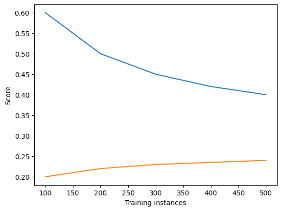

# Bias-Variance Tradeoff

## A: Balance

The Gaussian Naive Bayes classifier shows the training data shows convergence towards an actual predictive ability. In general, 85% accuracy is not very good for a classifier, which signals high bias. Total error is minimized somewhere between those regimes in the neighborhood of 500 samples in the train set.

The Support Vector Machine classifier works a lot better, never truly reaching the high-bias regime. A score near 100% is going to be high enough regardless, so 1500 will be a good place to best balance bias and variance.

## B: Regimes

For a small dataset, both classifiers operate in a high variance, low bias regime. However, this changes in the large dataset: the Gaussian operates in a high-bias regime, while the SVM has optimally balanced the two.

## C: Modification

Models in a high bias regime should have their complexity increased somehow. If there are additional features to add that are correlated with the predicted variable or a more complicated model that can be used (giving the Gaussian model extra gaussians or the SVM a more complicated function), both of those can go a long way towards reducing bias in the machines.

A high variance regime can usually be resolved by increasing the size of the train data. However, that can only go so far. If that is insufficient, then the model is likely too complex and is overfitting. The Gaussian model should use fewer gaussians, and the SVM should use a simpler equation.

## D: Data size

The Gaussian model is struggling with high bias due to underfitting. Additional data would likely not help its ability to classify unseen data, as it seems to cap out around 85% accurate under the given hyperparameters.

Though the SVM is also quickly approaching its accuracy asymptote, it is not operating in a high bias regime. Additional training data seems to allow for greater generalization at this point, so I would expect better performance when given more data.

## E: New plot

A model that underfits will have a large error (thus a low score) no matter how much training data it has. It also will be largely incapable of generalization.
